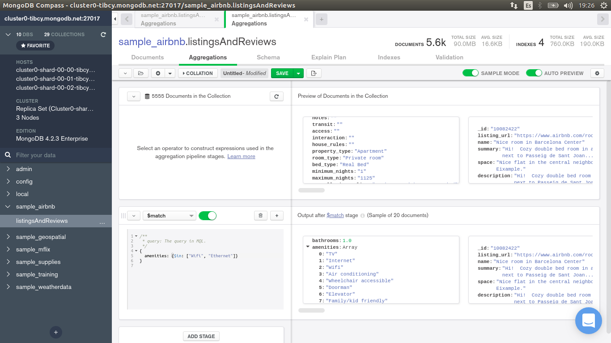
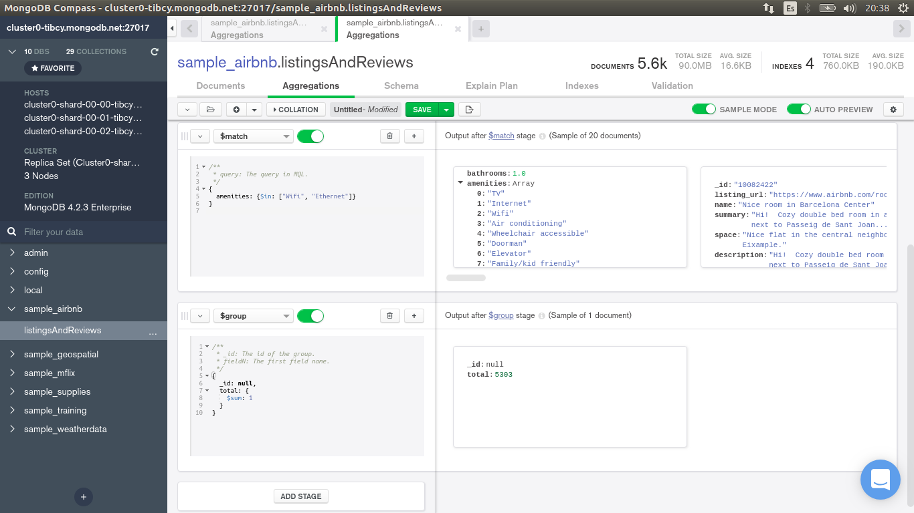

[`Introducción a Bases de Datos`](../../README.md) > [`Sesión 06`](../Readme.md) > `Reto 3`
	
## Reto 3: Introducción a las agregaciones

<div style="text-align: justify;">

### 1. Objetivos :dart: 

- Proyectar columnas sobre distintos documentos para repasar algunos conceptos.

### 2. Requisitos :clipboard:

1. MongoDB Compass instalado.

### 3. Desarrollo :rocket:

Usando la colección `sample_airbnb.listingsAndReviews`, mediante el uso de agregaciones, encontrar el número de publicaciones que tienen conexión a Internet, sea desde Wifi o desde cable (Ethernet).

<details><summary>Solución</summary>
<p>
	
1. Primero filtramos los documentos con Internet desde Wifi o desde cable. Para ello usamos `$match` que permite realizar filtros dentro de agregaciones.

   ```json
   {
      amenities: {$in: ["Wifi", "Ethernet"]}
   }
   ```

   
   
2. Ahora contamos el número de registros resultantes con `$group`. Los agrupamientos al igual que en __SQL__ necesitan un campo por el cual agrupar y una función de agrupamiento.

   - Dado que contaremos los registros no necesitamos campo, así que ponemos `_id: null`.
   
   - Para agrupar usaremos la función `$sum` con el parámetro `1`. Es decir, por cada documento sumará un 1, trayendo al final el total de documentos.
   
   ```json
   {
      _id: null,
      total: {
         $sum: 1
      }
   }
   ```
   
   

</p>
</details>

<br/>

[`Anterior`](../Ejemplo-03/Readme.md) | [`Siguiente`](../Readme.md)

</div>
